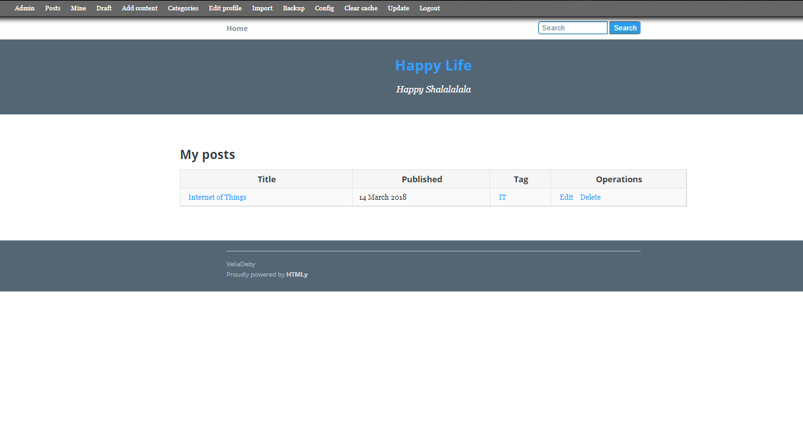
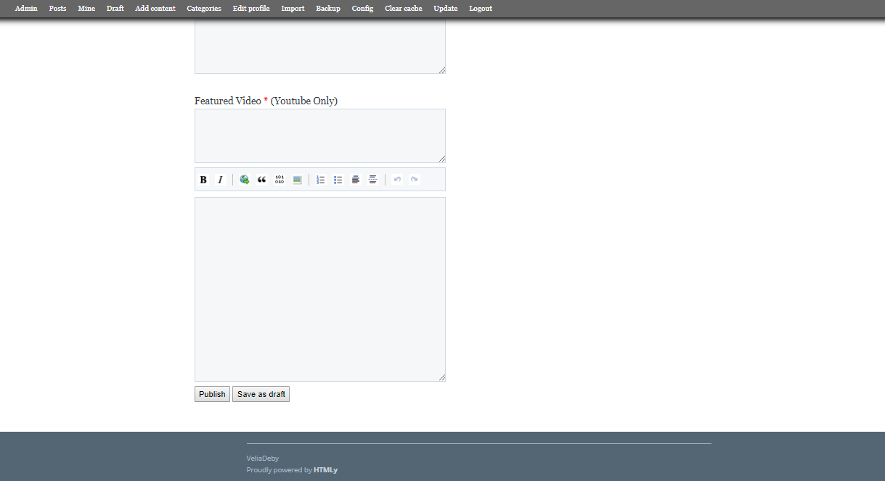
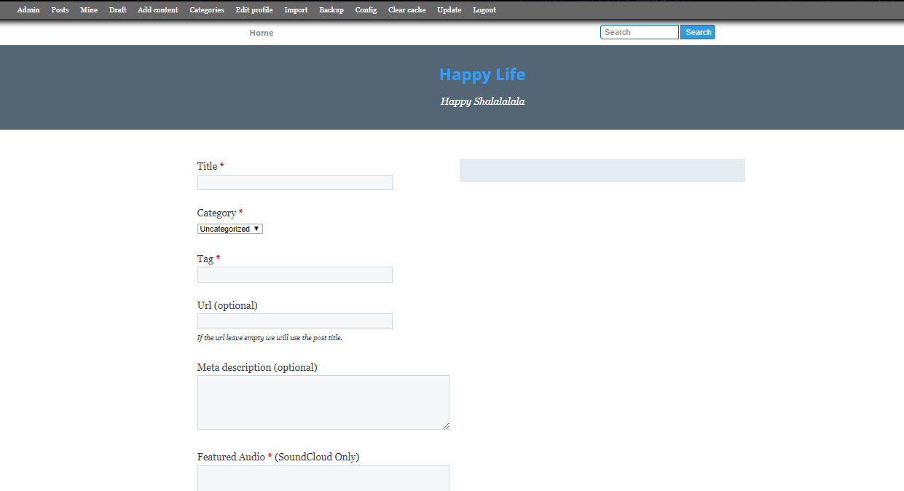
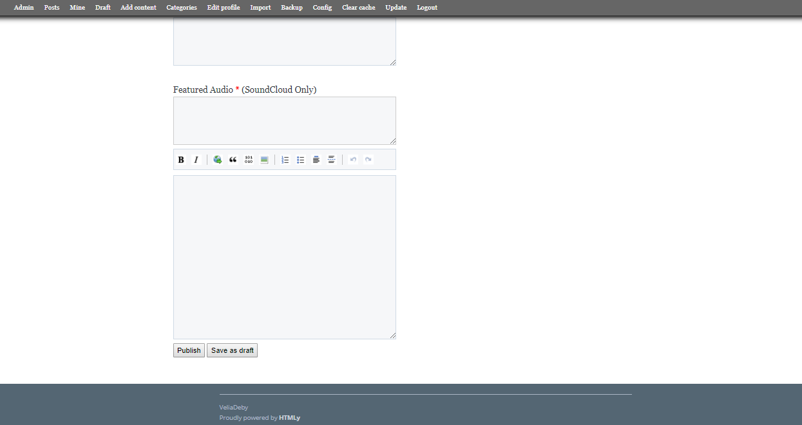
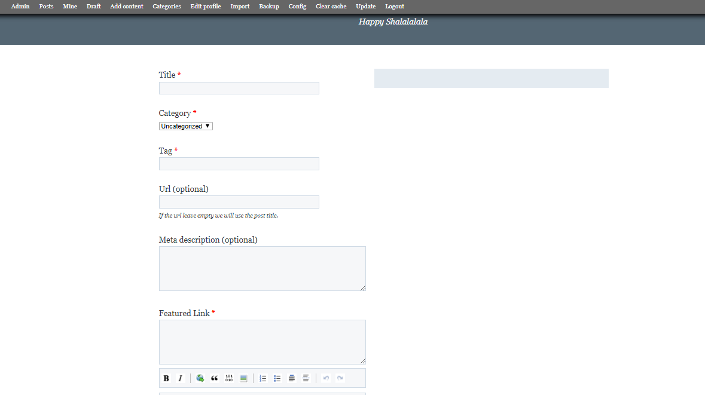
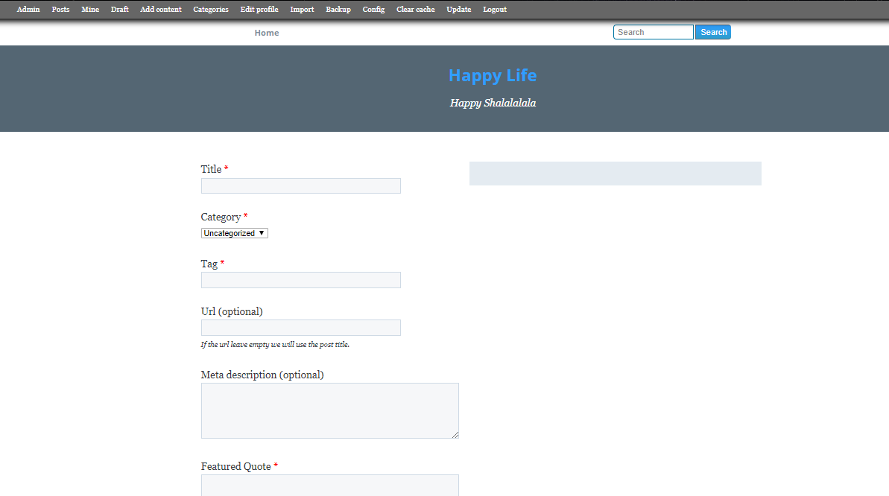
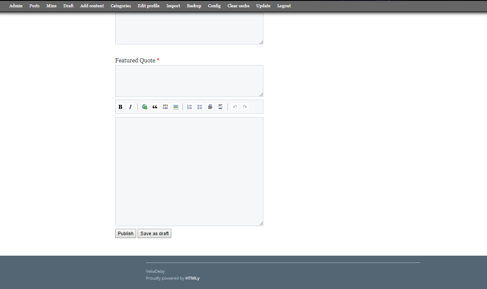
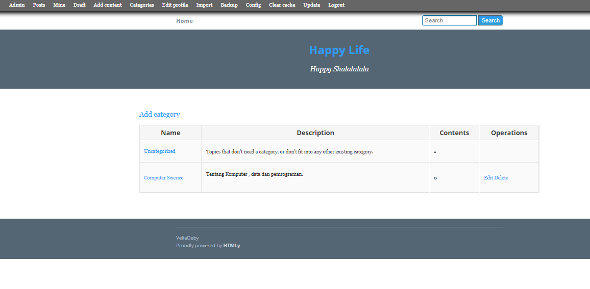
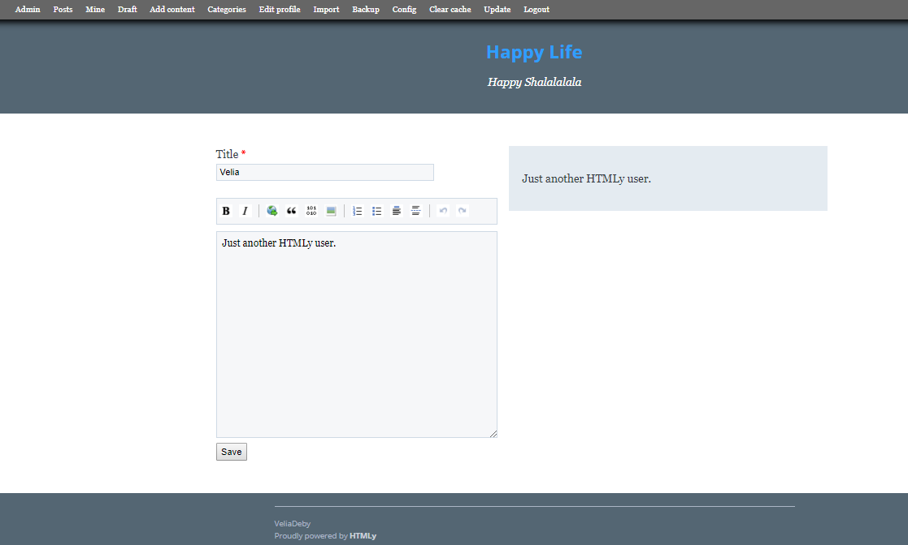

<h1 align="center"></h1>

[Sekilas Tentang](#sekilas-tentang) | [Instalasi](#instalasi) | [Konfigurasi](#konfigurasi) | [Otomatisasi](#otomatisasi) | [Cara Pemakaian](#cara-pemakaian) | [Pembahasan](#pembahasan) | [Referensi](#referensi)
:---:|:---:|:---:|:---:|:---:|:---:|:---:


# Sekilas Tentang
[`^ kembali ke atas ^`](#)

HTMLy adalah open source Databaseless Blogging Platform atau Flat-File Blog yang mengutamakan kesederhanaan dan kecepatan yang ditulis dalam PHP. HTMLy merupakan Flat-File CMS yang baik dalam mengelola konten blog.

HTMLy menggunakan algoritme unik untuk menemukan atau mencantumkan konten berdasarkan tanggal, jenis, kategori, tag, atau pengarang, dan kinerjanya akan tetap berjalan dengan cepat meskipun kita memiliki ribuan pos dan ratusan tag.

Sebagai flat-file blog atau flat-file CMS, HTMLy didesain untuk berjalan lancar meski menggunakan spesifikasi server minimal. Dengan RAM 512MB atau bahkan kurang, bisa menangani lebih dari sepuluh ribu postingan tanpa masalah.


# Instalasi
[`^ kembali ke atas ^`](#)

#### Kebutuhan Sistem :
- Unix, Linux atau Windows.
- Apache Web server 1.3+.
- PHP 5.2+.
- MySQL 5.0+.
- RAM minimal 64 Mb+

#### Proses Instalasi :
1. Login kedalam server menggunakan SSH. Untuk pengguna windows bisa menggunakan aplikasi [PuTTY](http://www.putty.org/).
    ```
    $ ssh adam@172.18.88.88 -p 22
    ```

2. Pastikan seluruh paket sistem kita *up-to-date*, dan install seluruh kebutuhan sisrem seperti `Apache`, `PHP`, dan `MySQL`.
    ```
    $ sudo apt-get update
    $ sudo apt-get install apache2
    $ sudo apt-get install mysql-server
    $ sudo apt-get install php
    $ sudo apt-get install libapache2-mod-php
    $ sudo apt-get install php-mysql
    $ sudo apt-get install php-gd php-mcrypt php-mbstring php-xml php-ssh2 php-curl php-zip php-intl
    $ sudo apt-get install unzip
    ```

3. Unduh **Prestashop** ke dalam direktori kita. 
    ```
    $ wget https://download.prestashop.com/download/releases/prestashop_1.7.0.5.zip
    ```

4. Ekstrak file yang telah diunduh ke dalam direktori yang kita inginkan.
    ```
    $ sudo unzip prestashop_1.7.0.5.zip -d /var/www/html/prestashop
    ```

5. Ubah otorisasi kepemilikan ke user www-data (webserver)
    ```
    $ sudo chown -R www-data:www-data /var/www/html/prestashop
    ```

6. Buat database dan user untuk **Prestashop**.
    ```
    $ mysql -u root -p -v -e "
        CREATE DATABASE prestashop;
        CREATE USER 'prestashopuser'@'localhost' IDENTIFIED BY 'prestashoppassword';
        GRANT ALL PRIVILEGES ON `prestashop`.* TO 'prestashopuser'@'localhost';
        FLUSH PRIVILEGES;"
    ```

7. Konfigurasi Apache web server.
    ```
    $ sudo a2enmod rewrite
    $ sudo touch /etc/apache2/sites-available/prestashop.conf
    $ sudo ln -s /etc/apache2/sites-available/prestashop.conf /etc/apache2/sites-enabled/prestashop.conf
    $ sudo nano /etc/apache2/sites-available/prestashop.conf

    <VirtualHost *:80>
    ServerAdmin admin@your-domain.com
    DocumentRoot /var/www/html/prestashop/
    ServerName your-domain.com
    ServerAlias www.your-domain.com
    <Directory /var/www/html/prestashop/>
    Options FollowSymLinks
    AllowOverride All
    Order allow,deny
    allow from all
    </Directory>
    ErrorLog /var/log/apache2/your-domain.com-error_log
    CustomLog /var/log/apache2/your-domain.com-access_log common
    </VirtualHost>
    ```

8. Edit file `etc/php/7.0/apache2/php.ini` dan tambahkan baris berikut :
    ```
    memory_limit = 128M
    upload_max_filesize = 16M
    max_execution_time = 60
    file_uploads = On
    allow_url_fopen = On
    magic_quotes_gpc = Off
    register_globals = Off
    ```

9. Restart kembali Apache web server.
    ```
    $ sudo service apache2 restart
    ```

10. Kunjungi alamat IP web server kita untuk meneruskan instalasi.
    - Pilih Bahasa yang akan digunakan

      

    - Setujui persyaratan yang berlaku

      

    - Cek kecocokan sistem

      

    - Isi informasi tentang toko yang kita buat

      

    - Konfigurasi database

      

    - Lanjutkan proses instalasi

      

11. Setelah proses instalasi selesai hapus direktori install untuk alasan keamanan.
    ```
    $ sudo rm -rf /var/www/html/prestashop/install
    ```


# Konfigurasi
[`^ kembali ke atas ^`](#)

- Untuk menentukan konfigurasi umum, kuota upload, dan pemberitahuan, kita dapat membuka submenu **Administration** pada menu **Advanced Parameters** dan mengisi field sesuai kebutuhan. 
    
    

    

- Untuk melengkapi aplikasi, kita dapat menambahkan fitur atau modul-modul tertentu pada menu `Modules`.

    

- Untuk memperindah aplikasi, kita dapat mengganti tema aplikasi pada menu `Design`.

    


# Maintenance
[`^ kembali ke atas ^`](#)

Ketika kita ingin memodifikasi toko yang sudah terinstall, kita mungkin tidak ingin ada orang lain yang membuka aplikasi kita. Pada saat seperti itu, kita dapat mengkonfigurasi aplikasi kita untuk masuk ke dalam *maintenance mode*. Berikut ini adalah langkah-langkah yang harus kita lakukan :
1. Login ke dalam admin toko kita.
2. Klik submenu **General** pada menu **Shop Parameters**.

    

3. pilih tab **Maintenance**.

    

4. Klik tombol `on` atau `off` untuk menjalankan atau mematikan *maintenance mode*.
5. Jika kita ingin agar teman kita dapat membuka aplikasi saat sedang dalam *maintenance mode*, masukkan **IP Adress** miliknya ke dalam field **Maintenance IP**.
6. Tuliskan pesan yang ingin kita sampaikan ketika ada orang yang membuka aplikasi kita saat sedang maintenance ke dalam field **Custom Maintenance Text**
7. Klik tombol **Save** untuk menyimpan perubahan.


# Otomatisasi
[`^ kembali ke atas ^`](#)

Jika kalian masih merasa kesulitan dalam meng-install **Prestashop**, terdapat dua cara alternatif yang lebih mudah. Cara pertama adalah dengan menggunakan `script shell` yang otomatis akan menjalankan semua perintah instalasi pada terminal. Contoh `script shell` yang dapat kita gunakan adalah [setup.sh](../master/setup.sh)

Cara kedua adalah dengan menggunakan layanan yang tersedia pada *web-hosting provider*. Dengan layanan tersebut kita hanya perlu satu kali klik untuk meng-install **Prestashop**. Berikut langkah-lankah untuk melakukannya :
1. kita perlu mengunjungi *web-hosting provider* yang menyediakan *script* instalasi **prestashop** otomatis, seperti [SimpleScripts](http://www.simplescripts.com/script_details/install:PrestaShop), [Installatron](http://installatron.com/prestashop), atau [Softaculous](http://www.softaculous.com/apps/ecommerce/PrestaShop).
2. Sebagai contoh, kita akan menggunakan layanan dari [Installatron](http://installatron.com/prestashop). Kunjungi link tersebut lalu klik tombol **Install this Application**.

    

3. Isi semua informasi yang dibutuhkan, lalu klik tombol **Install**.

    

4. Tunggu hingga proses instalasi selesai.


# Cara Pemakaian
[`^ kembali ke atas ^`](#)

Cara pemakaian **HTMLy** ini sangat mudah, karena aplikasi ini menyediakan *interface* yang sederhana sehingga mudah dimengerti. Berikut untuk lebih jelasnya :
1. Sebelum menggunakan HTMLy, kita wajib mengisi *username* dan *password*, selebihnya seperti deskripsi singkat tentang Blog yang ingin di buat dan link akun bersifat opsional. 

    

2.Setelah mengisi username dan password selanjutnya kita akan masuk ke halaman *Home*. Di halaman *Home* kita bisa langsung membuat 

    
    
    

3.  Berikut ini tampilan setelah kita mencoba membuat post blog di HTMLy


    
    
    
    

4. Pada tampilan HTMLy di bagian atas terdapat berbagai menu yang dapat kita gunakan. Pada menu Post kita bisa melihat daftar post yang pernah kita buat dan kita juga bisa menambah post.

	

5. Menu **Add Content** berisi kategori post, kita bisa membuat post sesuai dengan kebutuhan yang kita inginkan. **Regular post** untuk memposting tulisan biasa. **Image post** untuk memposting tulisan yang bisa disisipi gambar. **Video post** untuk memposting tulisan yang bisa disisipi video. **Audio post** untuk memposting tulisan yang bisa disisipi audio. **Link Post** untuk memposting tulisan yang bisa disisipi dengan *featured link*. **Quote post** untuk memposting tulisan yang bisa disisipi dengan *featured Quote*. **Static page** untuk membuat halaman statis.

	

	Berikut tampilan Image post
    - 
   
    - 
    
    Berikut tampilan Video post
    - 
    
    - 
    Berikut tampilan Audio post
    - 
    - 
    Berikut tampilan Link post
    - 
    - 
    Berikut tampilan Quote post
	- 
    - 


6. Menu **Categories**, kita bisa menambah kategori untuk postingan kita dengan tujuan tulisan bisa di kelompokan sesuai dengan kategori yang diinginkan. 
	- 
    - 
    - 
    

7. Menu **Edit Profile** digunakan untuk mengedit profile. Pada halaman ini tidak ada foto profile user  melainkan hanya ada edit judul blog dan penjelasan tentang blog.

  	- 
    - 
    - 
    

8. Menu **Config** digunakan untuk mengatur tampilan Blog.

   

9. Menu **Logout** untuk keluar dari akun blog kita. Berikut ini tampilan setelah keluar dari blog.
	- 

  


# Pembahasan
[`^ kembali ke atas ^`](#)

HTMLy adalah Databaseless Blogging Platform yang open source dan mengutamakan kesederhanaan dan kecepatan yang ditulis dalam PHP. 
- Kelebihan HTMLy adalah
1. HTMLy menggunakan algoritme unik untuk menemukan atau mencantumkan konten berdasarkan tanggal, jenis, kategori, tag, atau pengarang, dan kinerjanya akan tetap berjalan dengan cepat meskipun HTMLy memiliki ribuan pos dan ratusan tag.
2. Sebagai flat-file blog atau flat-file CMS, HTMLy didesain untuk berjalan lancar meski menggunakan spesifikasi server minimal. Dengan RAM 512MB atau bahkan kurang, seharusnya bisa menangani lebih dari 10000 postingan tanpa masalah apapun.

- Kekurangan HTMLy
1. Tidak ada autosave p
2. ada saat menulis post baru.
3. Tidak memiliki opsi save as a draft.
4. Tidak dapat upload gambar dari editor.

Jika dibandingkan dengan CMS sejenisnya seperti Magento, CMS ini memiliki beberapa 		keunggulan dan kelemahan. Berikut adalah beberapa perbandingan antara kedua CMS ini :

# Referensi
[`^ kembali ke atas ^`](#)

1. [About PrestaShop](https://www.prestashop.com/) - PrestaShop
2. [How to Log Into a VPS with PuTTY on Windows](https://www.digitalocean.com/community/tutorials/how-to-log-into-a-vps-with-putty-windows-users) - DigitalOcean
3. [How to Install PrestaShop on Ubuntu 16.04](http://idroot.net/linux/install-prestashop-ubuntu-16-04/) - idroot
4. [One Click Install PrestaShop](https://www.prestashop.com/blog/en/how-to-install-prestashop/) - PrestaShop
5. [PrestaShop Review](http://whichshoppingcart.com/prestashop.html) - whishshoppingcart
